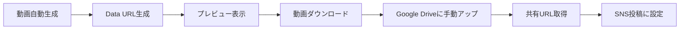

# 動画投稿の仕組みについて

## 現在の実装方法

### Data URLとは？
- 動画データを**Base64**という形式でテキストに変換
- `data:video/webm;base64,xxxxx...` という長い文字列になる
- ブラウザのメモリ内に一時的に保存される

### 制限事項
1. **ファイルサイズの制限**
   - Data URLは非常に長い文字列になる（20秒の動画で数MB）
   - ブラウザやシステムによっては処理できない場合がある

2. **SNS APIの制限**
   - Twitter/Instagram APIは**実際のファイル**または**URL**が必要
   - Data URLを直接投稿することはできない

3. **保存の問題**
   - ブラウザを閉じるとデータが消える
   - Google Sheetsには長すぎて保存できない

## 実際のSNS投稿で動画を使うには

### 方法1: Google Drive経由（推奨）
```
1. 動画を自動生成
2. 「動画をダウンロード」でWebMファイルを保存
3. Google Driveにアップロード
4. 共有リンクを取得
5. そのURLを投稿に設定
```

### 方法2: 動画ホスティングサービス
- YouTube、Vimeo等にアップロード
- 埋め込みURLを使用

### 方法3: 画像のみ投稿
- 動画の代わりにサムネイル画像を使用
- スライドショーの1枚目を静止画として投稿

## なぜGoogle Driveが必要なのか？

1. **永続的な保存**
   - URLでいつでもアクセス可能
   - ブラウザを閉じても消えない

2. **API対応**
   - TwitterやInstagramのAPIが要求する形式
   - 実際のファイルURLが必要

3. **自動投稿との連携**
   - GitHub Actionsから参照可能
   - Google Sheets経由で管理できる

## 改善案

### 将来的な実装
1. **サーバーサイドストレージ**
   - 動画を自動的にクラウドにアップロード
   - APIキーを使用してGoogle Driveに自動保存

2. **静止画での代替**
   - 動画の代わりにアニメーションGIF
   - キーフレームを抽出して画像として投稿

3. **外部サービス連携**
   - CloudinaryやImgur等の画像/動画ホスティング
   - 自動アップロードAPI

## 現在の使い方まとめ



**結論**: 現在の実装では、完全自動化はできませんが、動画生成の手間は大幅に削減されています。Google Driveへのアップロードは手動で行う必要がありますが、これはセキュリティとAPIの制限によるものです。